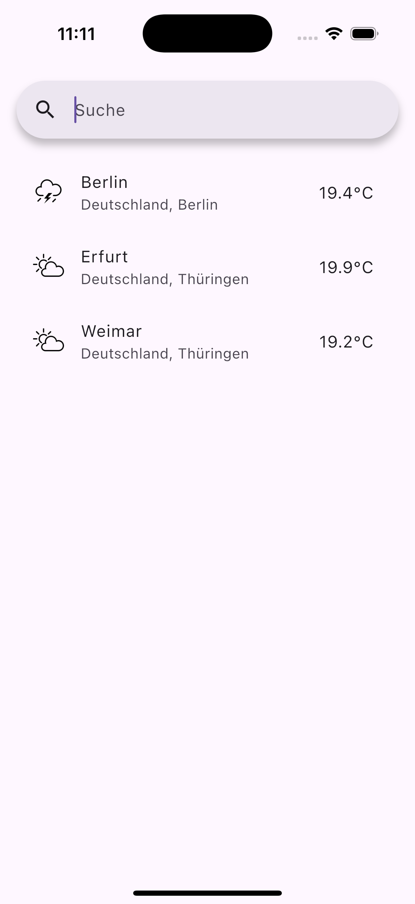
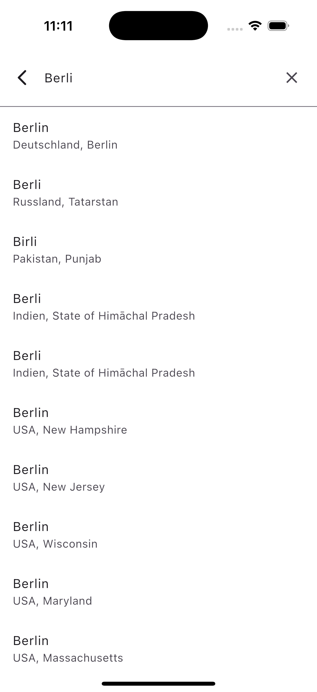
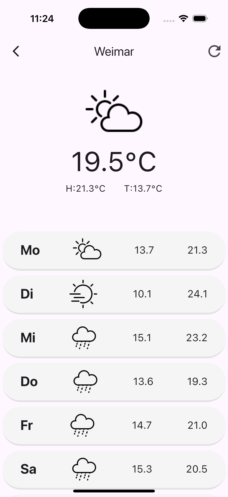

# ☀️ Weatherly – Your Minimalist Forecast Companion

**Weatherly** is a minimalist Flutter weather app that helps users search for cities with auto-complete suggestions, save favorite locations locally, and view multi-day weather forecasts – all powered by the free and privacy-friendly [Open-Meteo API](https://open-meteo.com/).

---

## Navigation

Use this quick index to jump directly to key sections of the README:

- [Screenshots](#screenshots)  
- [Features](#features)  
- [APIs Used](#apis-used)  
- [Getting Started](#getting-started)  
- [Lessons Learned & Reflections](#lessons-learned--reflections)  
- [About](#about)  

---

## Screenshots

Explore **Weatherly**’s core features through these screenshots.

<table style="border-collapse: collapse; border: none;">
  <tr>
    <td align="center">
       Home with saved cities
    </td>
    <td align="center">
       City Search with Suggestions
    </td>
    <td align="center">
       Forecast for Next Days
    </td>
  </tr>
</table>

---

## Features

- **City Search with Auto-Suggestions**  
  Instantly search and auto-complete city names using Open-Meteo’s Geocoding API. Also used for fetching accurate weather forecasts for each city.

- **Local Storage of Favorite Cities**  
  Save multiple locations locally with `shared_preferences`, and remove them easily when desired.

- **Multi-Day Weather Forecasts**  
  View current temperature plus daily min/max temperatures for upcoming days, enhanced with clear weather icons.

- **Support for Multiple Cities**  
  Fetch forecasts for all saved locations in parallel, ensuring up-to-date information.

---

## APIs Used

### Open-Meteo Geocoding & Weather Forecast API

Used for searching, auto-completing city names, and fetching detailed weather forecasts, combining geolocation and forecast data seamlessly.

---

## Getting Started

1. Clone the repository  
2. Run `flutter pub get` to install dependencies  
3. Launch the app on your emulator or physical device using `flutter run`

---

## Lessons Learned & Reflections

Developing **Weatherly** provided valuable insights and skills, including:

- **API Integration:** Combining geocoding and weather forecast APIs to deliver a smooth user experience.  
- **Asynchronous Programming:** Managing multiple parallel API calls efficiently without blocking the UI.  
- **State & Local Storage Management:** Leveraging `shared_preferences` to persist user data and reflect changes instantly.  
- **UI/UX Design:** Creating intuitive search suggestions and clear weather visuals to enhance usability.  

This project highlighted the importance of thoughtful architecture and user-centered design, inspiring future enhancements like real-time weather updates and offline support.

---

## About

**Weatherly** was created as a personal project to explore Flutter development and weather API integration while focusing on minimalism and privacy. The app emphasizes simplicity, ease of use, and practical utility for everyday weather needs.

---

